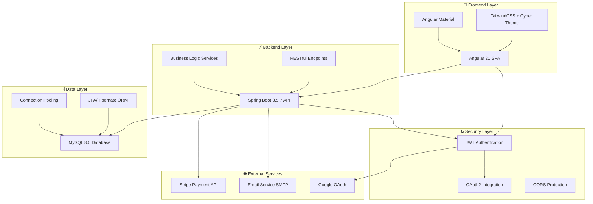
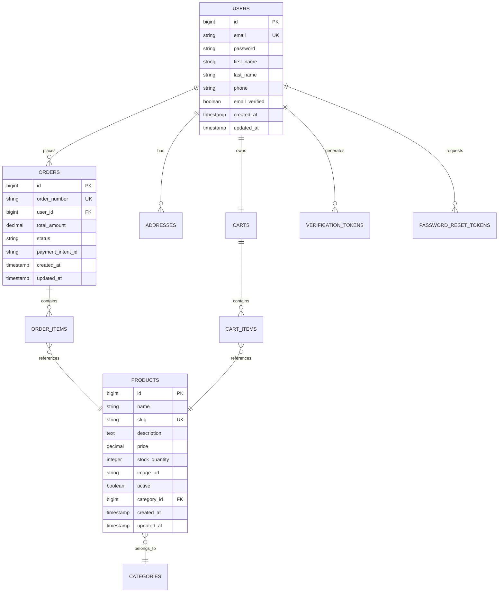

<div align="center">

```
    ___    ____  ____     ________    ________________  ____  _   _______________
   /   |  /  _/ / __ )   / ____/ /   / ____/ ____/_  __/ __ \/ | / /  _/ ____/ ___/
  / /| |  / /  / __  |  / __/ / /   / __/ / /     / / / /_/ /  |/ // // /    \__ \ 
 / ___ |_/ /  / /_/ /  / /___/ /___/ /___/ /___  / / / _, _/ /|  // // /___ ___/ / 
/_/  |_/___/ /_____/  /_____/_____/_____/\____/ /_/ /_/ |_/_/ |_/___/\____//____/  
```

# ⚡ **AIB ELECTRONICS** ⚡
## 🌐 **CYBER-TECH E-COMMERCE PLATFORM** 🌐

<div style="background: linear-gradient(135deg, #00f0ff, #ff00ff); padding: 3px; border-radius: 25px; display: inline-block; margin: 25px 0;">
  <div style="background: #0a0a0f; padding: 25px; border-radius: 22px; text-align: center;">
    
  </div>
</div>

**🚀 NEXT-GENERATION E-COMMERCE • IMMERSIVE SHOPPING EXPERIENCE 🚀**

<div style="display: flex; justify-content: center; gap: 12px; flex-wrap: wrap; margin: 30px 0;">


</div>

<div style="background: linear-gradient(135deg, rgba(0,240,255,0.15), rgba(255,0,255,0.15)); border: 2px solid rgba(0,240,255,0.4); border-radius: 20px; padding: 25px; margin: 30px 0; backdrop-filter: blur(15px); box-shadow: 0 0 30px rgba(0,240,255,0.2);">
  <strong style="font-size: 1.2em; letter-spacing: 2px;">🎯 IMMERSIVE • RESPONSIVE • SECURE • SCALABLE • FUTURISTIC 🎯</strong>
</div>

---

<div style="background: linear-gradient(90deg, transparent, rgba(0,240,255,0.3), transparent); height: 2px; margin: 20px 0;"></div>

</div>

---

## 🌟 **SYSTEM OVERVIEW**

AIB Electronics represents the pinnacle of modern e-commerce technology - a **cyber-enhanced shopping platform** that merges cutting-edge design with enterprise-grade functionality. Built for the digital age, it delivers an **immersive, responsive, and secure** shopping experience that feels like stepping into the future.

<div align="center">

### ⚡ **CORE CAPABILITIES** ⚡

</div>

<table style="width: 100%; border-collapse: collapse; margin: 20px 0;">
<tr>
<td width="50%" style="padding: 20px; background: linear-gradient(135deg, rgba(0,240,255,0.1), rgba(0,240,255,0.05)); border: 1px solid rgba(0,240,255,0.2); border-radius: 15px; margin: 10px;">

**🛍️ CUSTOMER EXPERIENCE**
- 🔐 **Multi-Factor Authentication** (JWT + OAuth2)
- 🛒 **Intelligent Shopping Cart** with persistence
- 💳 **Stripe Payment Gateway** integration
- 📱 **Responsive Cyber Design** (Mobile-First)
- 🔍 **Advanced Product Search** & filtering
- 📧 **Real-time Email Notifications**
- 👤 **Comprehensive Profile Management**
- 📍 **Multi-Address Management**
- 📋 **Order Tracking & History**

</td>
<td width="50%" style="padding: 20px; background: linear-gradient(135deg, rgba(255,0,255,0.1), rgba(255,0,255,0.05)); border: 1px solid rgba(255,0,255,0.2); border-radius: 15px; margin: 10px;">

**⚡ ADMIN COMMAND CENTER**
- 📊 **Real-time Analytics Dashboard**
- 📦 **Advanced Product Management**
- 🏷️ **Dynamic Category System**
- 👥 **User Management & Roles**
- 📋 **Order Processing Pipeline**
- 📈 **Sales Reports & KPIs**
- 🎯 **Performance Monitoring**
- 📧 **Automated Email Campaigns**
- 🔒 **Security & Access Control**

</td>
</tr>
</table>

<div style="background: linear-gradient(90deg, transparent, rgba(255,0,255,0.3), transparent); height: 2px; margin: 30px 0;"></div>

---

## 🏗️ **SYSTEM ARCHITECTURE**

<div align="center">



</div>

### 🔧 **TECHNOLOGY MATRIX**

<div style="background: linear-gradient(135deg, rgba(0,240,255,0.05), rgba(255,0,255,0.05)); border: 1px solid rgba(0,240,255,0.2); border-radius: 15px; padding: 20px; margin: 20px 0;">

| **Layer** | **Technology** | **Version** | **Purpose** |
|-----------|----------------|-------------|-------------|
| **🎨 Frontend** | Angular + TypeScript | 21.x / 5.9 | Modern, reactive SPA with type safety |
| **🎭 Styling** | TailwindCSS + Custom Theme | 3.4 | Cyber-tech design system & responsive UI |
| **⚡ Backend** | Spring Boot + Java | 3.5.7 / 17 | Enterprise-grade REST API & microservices |
| **🗄️ Database** | MySQL + JPA/Hibernate | 8.0 | Relational data storage with ORM |
| **🔒 Security** | JWT + Spring Security | Latest | Authentication, authorization & CORS |
| **💳 Payments** | Stripe API | v3 | Secure payment processing & webhooks |
| **📧 Communications** | Spring Mail + SMTP | Latest | Transactional emails & notifications |
| **🎯 State Management** | RxJS + Angular Services | Latest | Reactive state management & data flow |

</div>

<div style="background: linear-gradient(90deg, transparent, rgba(0,255,136,0.3), transparent); height: 2px; margin: 30px 0;"></div>

---

## 🚀 **QUICK START GUIDE**

<div style="background: linear-gradient(135deg, rgba(255,107,0,0.1), rgba(255,107,0,0.05)); border: 1px solid rgba(255,107,0,0.3); border-radius: 15px; padding: 20px; margin: 20px 0;">

### 📋 **SYSTEM REQUIREMENTS**

- ☕ **Java 17+** (OpenJDK recommended)
- 🟢 **Node.js 18+** with npm/yarn
- 🐬 **MySQL 8.0+** database server
- 📦 **Maven 3.6+** for backend builds
- 🅰️ **Angular CLI 21+** for frontend development
- 🔧 **Git** for version control

</div>

### ⚡ **INSTALLATION SEQUENCE**

<div style="background: linear-gradient(135deg, rgba(0,240,255,0.05), rgba(0,240,255,0.02)); border-left: 4px solid #00f0ff; padding: 20px; margin: 15px 0; border-radius: 0 10px 10px 0;">

**1️⃣ REPOSITORY SETUP**
```bash
# Clone the cyber-tech repository
git clone https://github.com/yourusername/aib-electronics.git
cd aib-electronics

# Verify project structure
ls -la
```

</div>

<div style="background: linear-gradient(135deg, rgba(255,0,255,0.05), rgba(255,0,255,0.02)); border-left: 4px solid #ff00ff; padding: 20px; margin: 15px 0; border-radius: 0 10px 10px 0;">

**2️⃣ BACKEND INITIALIZATION**
```bash
cd aib-backend

# Configure database connection
# Edit src/main/resources/application.yaml
# Update MySQL credentials and connection details

# Install dependencies and run
mvn clean install
mvn spring-boot:run

# Backend will be available at: http://localhost:8080
# API Documentation: http://localhost:8080/swagger-ui.html
```

</div>

<div style="background: linear-gradient(135deg, rgba(0,255,136,0.05), rgba(0,255,136,0.02)); border-left: 4px solid #00ff88; padding: 20px; margin: 15px 0; border-radius: 0 10px 10px 0;">

**3️⃣ FRONTEND DEPLOYMENT**
```bash
cd aib-frontend

# Install Angular dependencies
npm install

# Start development server with cyber theme
ng serve

# Frontend will be available at: http://localhost:4200
# Hot reload enabled for development
```

</div>

<div style="background: linear-gradient(135deg, rgba(168,85,247,0.05), rgba(168,85,247,0.02)); border-left: 4px solid #a855f7; padding: 20px; margin: 15px 0; border-radius: 0 10px 10px 0;">

**4️⃣ DATABASE SETUP**
```sql
-- Create database
CREATE DATABASE aib_electronics;

-- The application will auto-create tables on first run
-- Sample data will be initialized automatically
-- Check DataInitializer.java for default admin credentials
```

</div>

### 🎯 **ACCESS POINTS**

<div align="center">

| **Service** | **URL** | **Purpose** |
|-------------|---------|-------------|
| 🌐 **Frontend App** | `http://localhost:4200` | Main e-commerce interface |
| 🔧 **Backend API** | `http://localhost:8080` | REST API endpoints |
| 📊 **API Documentation** | `http://localhost:8080/swagger-ui.html` | Interactive API docs |
| 🗄️ **Database** | `localhost:3306/aib_electronics` | MySQL database |

</div>

<div style="background: linear-gradient(90deg, transparent, rgba(255,107,0,0.3), transparent); height: 2px; margin: 30px 0;"></div>

---

## 📁 **PROJECT STRUCTURE**

<div style="background: linear-gradient(135deg, rgba(59,130,246,0.05), rgba(59,130,246,0.02)); border: 1px solid rgba(59,130,246,0.2); border-radius: 15px; padding: 20px; margin: 20px 0;">

```
aib-electronics/
├── 🔙 aib-backend/                    # Spring Boot API Server
│   ├── 📂 src/main/java/com/aib/aib_backend/
│   │   ├── 🏗️ config/                # System Configuration
│   │   │   ├── SecurityConfig.java    # JWT & CORS setup
│   │   │   ├── StripeConfig.java      # Payment gateway config
│   │   │   └── JacksonConfig.java     # JSON serialization
│   │   ├── 🎮 controller/             # REST API Controllers
│   │   │   ├── AuthController.java    # Authentication endpoints
│   │   │   ├── ProductController.java # Product CRUD operations
│   │   │   ├── CartController.java    # Shopping cart management
│   │   │   ├── OrderController.java   # Order processing
│   │   │   ├── UserController.java    # User profile management
│   │   │   └── DashboardController.java # Admin analytics
│   │   ├── 📊 dto/                    # Data Transfer Objects
│   │   │   ├── request/               # API request models
│   │   │   └── response/              # API response models
│   │   ├── 🏛️ model/                  # JPA Entity Models
│   │   │   ├── User.java              # User account entity
│   │   │   ├── Product.java           # Product catalog entity
│   │   │   ├── Order.java             # Order management entity
│   │   │   ├── Cart.java              # Shopping cart entity
│   │   │   └── Category.java          # Product categories
│   │   ├── 📚 repository/             # Data Access Layer
│   │   │   ├── UserRepository.java    # User data operations
│   │   │   ├── ProductRepository.java # Product queries
│   │   │   ├── OrderRepository.java   # Order management
│   │   │   └── CartRepository.java    # Cart persistence
│   │   ├── � service/                # Business Logic Layer
│   │   │   ├── impl/                  # Service implementations
│   │   │   ├── AuthService.java       # Authentication logic
│   │   │   ├── ProductService.java    # Product management
│   │   │   ├── OrderService.java      # Order processing
│   │   │   ├── CartService.java       # Cart operations
│   │   │   └── EmailService.java      # Email notifications
│   │   ├── 🔒 security/               # Security Components
│   │   │   ├── JwtUtil.java           # JWT token management
│   │   │   ├── JwtAuthenticationFilter.java # Request filtering
│   │   │   └── CustomUserDetailsService.java # User authentication
│   │   ├── 🚨 exception/              # Error Handling
│   │   │   ├── GlobalExceptionHandler.java # Global error handler
│   │   │   └── ResourceNotFoundException.java # Custom exceptions
│   │   └── 🔧 util/                   # Utility Classes
│   └── 📂 src/main/resources/
│       ├── ⚙️ application.yaml        # Application configuration
│       ├── 📧 templates/              # Email templates
│       └── 🗄️ aib_routines.sql       # Database procedures
├── 🎨 aib-frontend/                   # Angular SPA Application
│   └── 📂 src/app/
│       ├── 🎯 core/                   # Core Application Services
│       │   ├── guards/                # Route protection
│       │   ├── interceptors/          # HTTP interceptors
│       │   └── services/              # Core business services
│       ├── 🎪 features/               # Feature Modules
│       │   ├── 🔐 auth/               # Authentication Module
│       │   │   └── components/        # Login, register, reset
│       │   ├── 🛒 cart/               # Shopping Cart Module
│       │   │   └── components/        # Cart, checkout, success
│       │   ├── 🏠 home/               # Homepage Module
│       │   │   └── components/        # Landing page, contact
│       │   ├── 📦 products/           # Product Catalog Module
│       │   │   └── components/        # Product list, details, categories
│       │   ├── 👤 profile/            # User Profile Module
│       │   │   └── components/        # Profile info, addresses, orders
│       │   ├── 📋 orders/             # Order Management Module
│       │   │   └── components/        # Order history, details
│       │   └── ⚡ admin/              # Admin Dashboard Module
│       │       ├── components/        # Dashboard, management panels
│       │       └── services/          # Admin-specific services
│       ├── 🤝 shared/                 # Shared Components & Models
│       │   ├── components/            # Reusable UI components
│       │   │   ├── header/            # Navigation header
│       │   │   ├── footer/            # Site footer
│       │   │   ├── cart-icon/         # Cart indicator
│       │   │   └── search-overlay/    # Search functionality
│       │   └── models/                # TypeScript interfaces
│       │       ├── user.model.ts      # User data models
│       │       ├── product.model.ts   # Product data models
│       │       ├── cart.model.ts      # Cart data models
│       │       └── order.model.ts     # Order data models
│       ├── 🎨 styles.css              # Cyber-tech global styles
│       ├── 🎭 custom-theme.scss       # Angular Material theme
│       └── 🌍 environments/           # Environment configurations
└── 📖 README.md                      # This documentation
```

</div>

<div style="background: linear-gradient(90deg, transparent, rgba(59,130,246,0.3), transparent); height: 2px; margin: 30px 0;"></div>

---

## 🎯 **FEATURE DEEP DIVE**

<div style="background: linear-gradient(135deg, rgba(0,240,255,0.08), rgba(255,0,255,0.08)); border: 1px solid rgba(0,240,255,0.3); border-radius: 20px; padding: 25px; margin: 25px 0;">

### 🔐 **AUTHENTICATION & SECURITY MATRIX**

<div style="display: grid; grid-template-columns: repeat(auto-fit, minmax(300px, 1fr)); gap: 20px; margin: 20px 0;">

<div style="background: rgba(0,240,255,0.05); border: 1px solid rgba(0,240,255,0.2); border-radius: 12px; padding: 15px;">

**🛡️ Multi-Layer Security**
- **JWT-based authentication** with refresh token rotation
- **Google OAuth 2.0 integration** for social login
- **Email verification system** with secure tokens
- **Password reset workflow** with time-limited tokens
- **Role-based access control** (Customer/Admin)
- **CORS protection** for cross-origin security
- **Input validation & sanitization** against XSS/SQL injection

</div>

<div style="background: rgba(255,0,255,0.05); border: 1px solid rgba(255,0,255,0.2); border-radius: 12px; padding: 15px;">

**� Advanced Protection**
- **BCrypt password hashing** with salt rounds
- **Rate limiting** on authentication endpoints
- **Session management** with secure cookies
- **HTTPS enforcement** in production
- **SQL injection prevention** via parameterized queries
- **XSS protection** with content security policies
- **CSRF token validation** for state-changing operations

</div>

</div>

</div>

<div style="background: linear-gradient(135deg, rgba(0,255,136,0.08), rgba(255,107,0,0.08)); border: 1px solid rgba(0,255,136,0.3); border-radius: 20px; padding: 25px; margin: 25px 0;">

### 🛒 **E-COMMERCE CORE ENGINE**

<div style="display: grid; grid-template-columns: repeat(auto-fit, minmax(300px, 1fr)); gap: 20px; margin: 20px 0;">

<div style="background: rgba(0,255,136,0.05); border: 1px solid rgba(0,255,136,0.2); border-radius: 12px; padding: 15px;">

**📦 Product Management**
- **Dynamic product catalog** with categories & subcategories
- **Advanced search & filtering** (price, category, rating, availability)
- **Product image galleries** with lazy loading
- **Inventory tracking** with low-stock alerts
- **Product reviews & ratings** system
- **Related products** recommendation engine
- **Bulk product operations** for admin efficiency

</div>

<div style="background: rgba(255,107,0,0.05); border: 1px solid rgba(255,107,0,0.2); border-radius: 12px; padding: 15px;">

**🛍️ Shopping Experience**
- **Persistent shopping cart** across sessions
- **Guest checkout** option for quick purchases
- **Multiple address management** for delivery
- **Order tracking** with status updates
- **Order history** with reorder functionality
- **Wishlist management** for future purchases
- **Cart conflict resolution** for logged-in users

</div>

</div>

</div>

<div style="background: linear-gradient(135deg, rgba(168,85,247,0.08), rgba(59,130,246,0.08)); border: 1px solid rgba(168,85,247,0.3); border-radius: 20px; padding: 25px; margin: 25px 0;">

### 💳 **PAYMENT & ORDER PROCESSING**

<div style="display: grid; grid-template-columns: repeat(auto-fit, minmax(300px, 1fr)); gap: 20px; margin: 20px 0;">

<div style="background: rgba(168,85,247,0.05); border: 1px solid rgba(168,85,247,0.2); border-radius: 12px; padding: 15px;">

**💰 Stripe Integration**
- **Secure payment processing** with PCI compliance
- **Multiple payment methods** (cards, digital wallets)
- **Payment intent creation** with 3D Secure support
- **Webhook handling** for payment confirmations
- **Refund processing** for order cancellations
- **Payment failure handling** with retry mechanisms
- **Currency support** for international transactions

</div>

<div style="background: rgba(59,130,246,0.05); border: 1px solid rgba(59,130,246,0.2); border-radius: 12px; padding: 15px;">

**📋 Order Management**
- **Order lifecycle management** (Pending → Processing → Shipped → Delivered)
- **Automated email notifications** at each status change
- **Order cancellation** with automatic refunds
- **Bulk order processing** for admin efficiency
- **Order search & filtering** by status, date, customer
- **Invoice generation** with PDF export
- **Shipping integration** ready for logistics providers

</div>

</div>

</div>

<div style="background: linear-gradient(135deg, rgba(255,0,85,0.08), rgba(255,200,0,0.08)); border: 1px solid rgba(255,0,85,0.3); border-radius: 20px; padding: 25px; margin: 25px 0;">

### 📊 **ADMIN COMMAND CENTER**

<div style="display: grid; grid-template-columns: repeat(auto-fit, minmax(300px, 1fr)); gap: 20px; margin: 20px 0;">

<div style="background: rgba(255,0,85,0.05); border: 1px solid rgba(255,0,85,0.2); border-radius: 12px; padding: 15px;">

**📈 Analytics Dashboard**
- **Real-time KPI monitoring** (sales, orders, users)
- **Interactive sales charts** with date range filtering
- **Top-selling products** analysis
- **Customer behavior insights** and trends
- **Revenue tracking** with growth metrics
- **Low stock alerts** for inventory management
- **Performance metrics** for system optimization

</div>

<div style="background: rgba(255,200,0,0.05); border: 1px solid rgba(255,200,0,0.2); border-radius: 12px; padding: 15px;">

**🎛️ Management Tools**
- **User management** with role assignment
- **Product CRUD operations** with bulk actions
- **Category management** with hierarchical structure
- **Order status updates** with notification triggers
- **Email template management** for communications
- **System configuration** for business rules
- **Audit logging** for compliance tracking

</div>

</div>

</div>

<div style="background: linear-gradient(90deg, transparent, rgba(255,0,85,0.3), transparent); height: 2px; margin: 30px 0;"></div>

---

## 🗄️ **DATABASE ARCHITECTURE**

<div style="background: linear-gradient(135deg, rgba(59,130,246,0.08), rgba(0,240,255,0.08)); border: 1px solid rgba(59,130,246,0.3); border-radius: 20px; padding: 25px; margin: 25px 0;">

<details>
<summary style="font-size: 1.2em; font-weight: bold; cursor: pointer; padding: 10px; background: rgba(59,130,246,0.1); border-radius: 10px; margin-bottom: 15px;">� Click to explore database structure</summary>

### 🏗️ **CORE ENTITY RELATIONSHIPS**



### 📊 **DATABASE TABLES OVERVIEW**

<div style="display: grid; grid-template-columns: repeat(auto-fit, minmax(300px, 1fr)); gap: 15px; margin: 20px 0;">

<div style="background: rgba(0,240,255,0.05); border: 1px solid rgba(0,240,255,0.2); border-radius: 10px; padding: 15px;">

**👥 User Management**
- **users** - User accounts and profiles
- **roles** - User roles and permissions (USER, ADMIN)
- **user_roles** - Many-to-many relationship table
- **addresses** - User delivery addresses
- **verification_tokens** - Email verification tokens
- **password_reset_tokens** - Password reset tokens

</div>

<div style="background: rgba(255,0,255,0.05); border: 1px solid rgba(255,0,255,0.2); border-radius: 10px; padding: 15px;">

**📦 Product Catalog**
- **products** - Product information and inventory
- **categories** - Product categories with hierarchy
- **product_images** - Product image galleries
- **product_reviews** - Customer reviews and ratings
- **product_attributes** - Dynamic product properties

</div>

<div style="background: rgba(0,255,136,0.05); border: 1px solid rgba(0,255,136,0.2); border-radius: 10px; padding: 15px;">

**🛒 Shopping & Orders**
- **carts** - User shopping carts
- **cart_items** - Items in shopping carts
- **orders** - Order headers with status
- **order_items** - Individual order line items
- **order_status_history** - Order status change tracking

</div>

<div style="background: rgba(255,107,0,0.05); border: 1px solid rgba(255,107,0,0.2); border-radius: 10px; padding: 15px;">

**💳 Payment & Analytics**
- **payments** - Payment transaction records
- **refunds** - Refund processing history
- **audit_logs** - System activity tracking
- **email_logs** - Email delivery tracking
- **system_settings** - Application configuration

</div>

</div>

### ⚡ **PERFORMANCE OPTIMIZATIONS**

<div style="background: rgba(168,85,247,0.05); border: 1px solid rgba(168,85,247,0.2); border-radius: 12px; padding: 15px; margin: 15px 0;">

- **🔍 Strategic Indexing** - Optimized indexes on frequently queried columns
- **🔗 Connection Pooling** - HikariCP for efficient database connections
- **📊 Query Optimization** - 30+ stored procedures for complex operations
- **🔒 Foreign Key Constraints** - Referential integrity enforcement
- **📝 Audit Fields** - Created/updated timestamps on all entities
- **🗂️ Partitioning Ready** - Table structure supports future partitioning
- **💾 Caching Strategy** - JPA second-level cache configuration

</div>

</details>

</div>

<div style="background: linear-gradient(90deg, transparent, rgba(59,130,246,0.3), transparent); height: 2px; margin: 30px 0;"></div>

---

## 🔒 **SECURITY & PERFORMANCE**

<div style="background: linear-gradient(135deg, rgba(255,0,85,0.08), rgba(168,85,247,0.08)); border: 1px solid rgba(255,0,85,0.3); border-radius: 20px; padding: 25px; margin: 25px 0;">

### �️ **SECURITY FORTRESS**

<div style="display: grid; grid-template-columns: repeat(auto-fit, minmax(280px, 1fr)); gap: 15px; margin: 20px 0;">

<div style="background: rgba(255,0,85,0.05); border: 1px solid rgba(255,0,85,0.2); border-radius: 10px; padding: 15px;">

**🔐 Authentication Security**
- **JWT token encryption** with RS256 algorithm
- **Refresh token rotation** for enhanced security
- **Multi-factor authentication** ready infrastructure
- **Session timeout** management
- **Brute force protection** with rate limiting

</div>

<div style="background: rgba(168,85,247,0.05); border: 1px solid rgba(168,85,247,0.2); border-radius: 10px; padding: 15px;">

**🛡️ Data Protection**
- **BCrypt password hashing** (12 rounds)
- **Input validation** with Bean Validation
- **SQL injection prevention** via JPA/Hibernate
- **XSS protection** with content sanitization
- **HTTPS enforcement** in production

</div>

<div style="background: rgba(0,240,255,0.05); border: 1px solid rgba(0,240,255,0.2); border-radius: 10px; padding: 15px;">

**🌐 Network Security**
- **CORS configuration** for cross-origin requests
- **CSRF token validation** for state changes
- **Content Security Policy** headers
- **Secure cookie configuration**
- **API rate limiting** per endpoint

</div>

<div style="background: rgba(0,255,136,0.05); border: 1px solid rgba(0,255,136,0.2); border-radius: 10px; padding: 15px;">

**🔍 Monitoring & Auditing**
- **Comprehensive audit logging**
- **Security event tracking**
- **Failed login attempt monitoring**
- **Suspicious activity detection**
- **Compliance reporting** ready

</div>

</div>

</div>

<div style="background: linear-gradient(135deg, rgba(0,255,136,0.08), rgba(255,200,0,0.08)); border: 1px solid rgba(0,255,136,0.3); border-radius: 20px; padding: 25px; margin: 25px 0;">

### ⚡ **PERFORMANCE OPTIMIZATIONS**

<div style="display: grid; grid-template-columns: repeat(auto-fit, minmax(280px, 1fr)); gap: 15px; margin: 20px 0;">

<div style="background: rgba(0,255,136,0.05); border: 1px solid rgba(0,255,136,0.2); border-radius: 10px; padding: 15px;">

**🚀 Frontend Performance**
- **Lazy loading** for Angular modules
- **OnPush change detection** strategy
- **Tree shaking** for bundle optimization
- **Image lazy loading** with intersection observer
- **Service worker** for caching (PWA ready)

</div>

<div style="background: rgba(255,200,0,0.05); border: 1px solid rgba(255,200,0,0.2); border-radius: 10px; padding: 15px;">

**🗄️ Database Optimization**
- **Strategic indexing** on query-heavy columns
- **Connection pooling** with HikariCP
- **Query optimization** with JPA criteria
- **Batch processing** for bulk operations
- **Database connection monitoring**

</div>

<div style="background: rgba(59,130,246,0.05); border: 1px solid rgba(59,130,246,0.2); border-radius: 10px; padding: 15px;">

**🔄 Caching Strategy**
- **HTTP response caching** with ETags
- **Static asset caching** with versioning
- **API response caching** for read-heavy endpoints
- **Browser caching** optimization
- **CDN ready** for global distribution

</div>

<div style="background: rgba(255,107,0,0.05); border: 1px solid rgba(255,107,0,0.2); border-radius: 10px; padding: 15px;">

**📊 Monitoring & Analytics**
- **Application performance monitoring**
- **Database query performance tracking**
- **Memory usage optimization**
- **Load testing** infrastructure ready
- **Error tracking** and alerting

</div>

</div>

</div>

<div style="background: linear-gradient(90deg, transparent, rgba(255,0,85,0.3), transparent); height: 2px; margin: 30px 0;"></div>

---

## 🤝 **CONTRIBUTING TO THE FUTURE**

<div style="background: linear-gradient(135deg, rgba(0,240,255,0.08), rgba(255,0,255,0.08)); border: 1px solid rgba(0,240,255,0.3); border-radius: 20px; padding: 25px; margin: 25px 0;">

We welcome contributions from developers who want to help build the future of e-commerce! Join our cyber-tech community and help us push the boundaries of what's possible.

### � **CONTRIBUTION WORKFLOW**

<div style="display: grid; grid-template-columns: repeat(auto-fit, minmax(250px, 1fr)); gap: 15px; margin: 20px 0;">

<div style="background: rgba(0,240,255,0.05); border: 1px solid rgba(0,240,255,0.2); border-radius: 10px; padding: 15px; text-align: center;">

**1️⃣ FORK & CLONE**
```bash
# Fork the repository
git fork aib-electronics

# Clone your fork
git clone your-fork-url
cd aib-electronics
```

</div>

<div style="background: rgba(255,0,255,0.05); border: 1px solid rgba(255,0,255,0.2); border-radius: 10px; padding: 15px; text-align: center;">

**2️⃣ CREATE BRANCH**
```bash
# Create feature branch
git checkout -b feature/cyber-enhancement

# Follow naming convention:
# feature/feature-name
# bugfix/issue-description
# hotfix/critical-fix
```

</div>

<div style="background: rgba(0,255,136,0.05); border: 1px solid rgba(0,255,136,0.2); border-radius: 10px; padding: 15px; text-align: center;">

**3️⃣ DEVELOP & TEST**
```bash
# Make your changes
# Follow coding standards
# Add comprehensive tests
# Update documentation

# Test your changes
npm test
mvn test
```

</div>

<div style="background: rgba(255,107,0,0.05); border: 1px solid rgba(255,107,0,0.2); border-radius: 10px; padding: 15px; text-align: center;">

**4️⃣ COMMIT & PUSH**
```bash
# Commit with clear message
git commit -m "feat: add cyber enhancement"

# Push to your fork
git push origin feature/cyber-enhancement
```

</div>

<div style="background: rgba(168,85,247,0.05); border: 1px solid rgba(168,85,247,0.2); border-radius: 10px; padding: 15px; text-align: center;">

**5️⃣ PULL REQUEST**
- Open PR with detailed description
- Reference related issues
- Include screenshots/demos
- Wait for code review
- Address feedback promptly

</div>

</div>

### 📋 **CONTRIBUTION GUIDELINES**

<div style="background: rgba(255,255,255,0.03); border: 1px solid rgba(255,255,255,0.1); border-radius: 12px; padding: 20px; margin: 15px 0;">

**🎯 What We're Looking For:**
- 🚀 Performance improvements and optimizations
- 🎨 UI/UX enhancements that match our cyber-tech theme
- 🔒 Security improvements and vulnerability fixes
- 📱 Mobile responsiveness and accessibility features
- 🧪 Test coverage improvements
- 📚 Documentation updates and examples
- 🌐 Internationalization and localization
- ⚡ New features that enhance the shopping experience

**📝 Code Standards:**
- Follow existing code style and conventions
- Write comprehensive unit and integration tests
- Update documentation for new features
- Use meaningful commit messages (Conventional Commits)
- Ensure backward compatibility
- Add proper error handling and logging

</div>

</div>

<div style="background: linear-gradient(90deg, transparent, rgba(0,240,255,0.3), transparent); height: 2px; margin: 30px 0;"></div>

---

